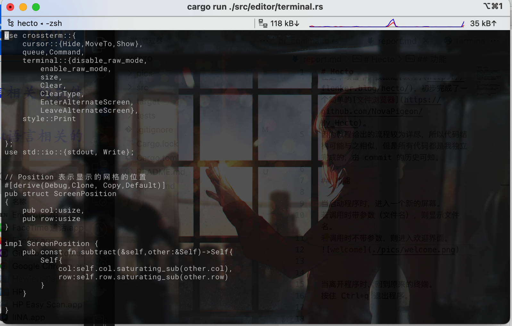
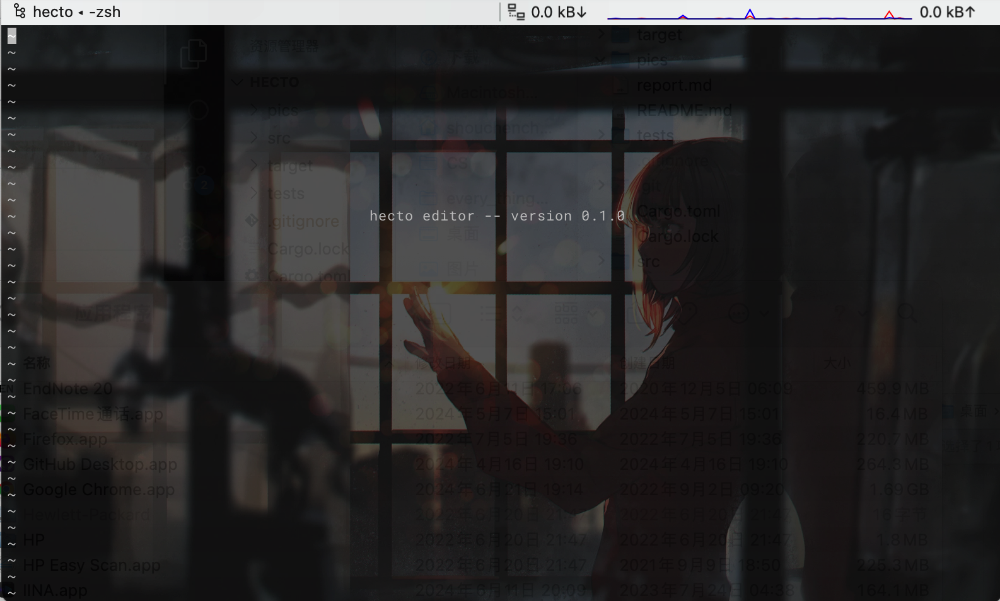
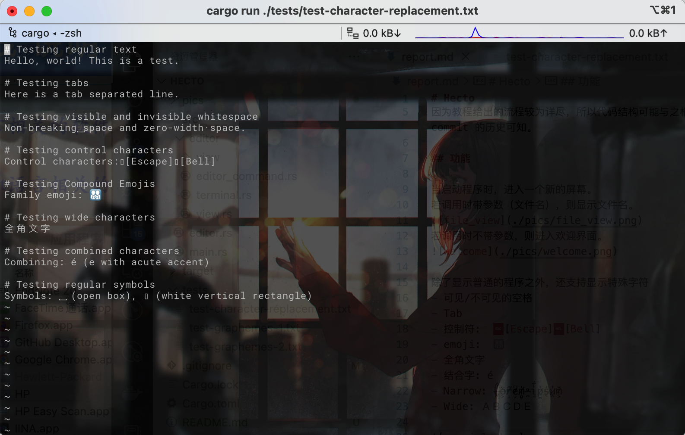
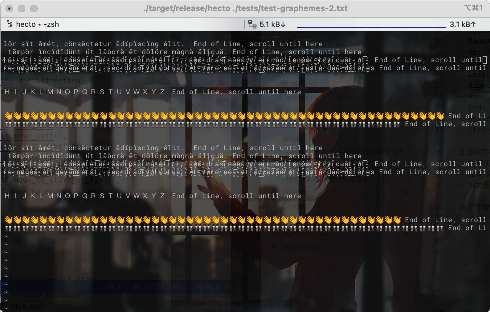

# Hecto
当启动程序时，进入一个新的屏幕。
若调用时带参数（文件名），则显示文件名。

若调用时不带参数，则进入欢迎界面。

除了显示普通的程序之外，还支持显示特殊字符
- 可见/不可见的空格
- Tab
- 控制符:  scape][Bell]
- emoji:  👨‍👩‍👧‍👦
- 全角文字
- 结合字: é
- Narrow: L̶̯̈́ö̶͕r̸̝͂e̷̗͆m̸̻̍ ̶̯̊i̵̘͋p̷̪̉s̵̨̒u̷̯̓m̷͕̆ 
- Wide: ＡＢＣＤＥ

Hecto 还支持各种事件的触发
- PageUp: 向上移动到屏幕的第一行
- PageDown: 向下移动到屏幕的最后一行
- Up: 向上移动一行，到上一行对应列处
- Down: 向下移动一行，到下一行对应列处
- Left: 向左移动一个字符，如果已经在最左边了，则移动到上一行的末尾
- Right: 向右移动一个字符，如果已经在最右边了，则移动到下一行的开始
- Home: 移动到本行的开始
- End: 移动到本行的结束
- Resize: 调整屏幕的大小，重新渲染
- Ctrl+q: 退出程序，回到原来的终端

上述所有移动都要遵守以下规则：
- 只能在文本范围内移动
- 如果移动已经超出了屏幕的边界，则作 Scrolling(即整体移动)
- 因为支持不同宽度的文字，所以所有的移动都会吸附到合法的字符偏移量处。

为了节省性能，Hecto 只在整体视图有改变时重新渲染。